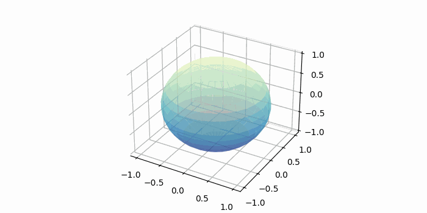
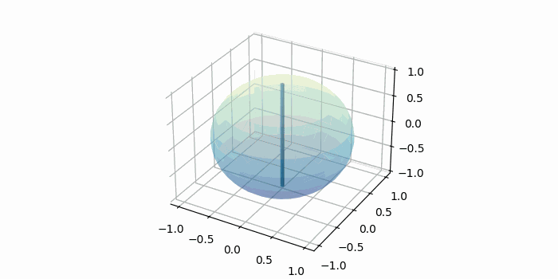

# Visualizations of Disc and Shell Integration

AP Calculus AB and BC integration problems often involve rotating some function around the x- or y-axis. 

This project aims to generate basic visualizations for the various integration techniques (performed on a sphere).

## Outline

### Disc Integration

Disc integration is a technique for finding the volume of a solid of revolution. Two-dimensional discs are accumulated across a single axis, where the radius of each disc is given by the function height. 

### Shell Integration 

Shell integration finds the volume of a solid of revolution using cylindrical shells. The cylindrical shells grow in radius to cover the entire volume. We integrate to sum all shells for the total volume.

## Dependencies

The animations are generated using:
- **matplotlib** for 3D plotting and rendering
- **NumPy** for mathematical calculations
- **PIL (Pillow)** for GIF compilation

The animations are generated frame-by-frame and later combined together into a GIF.

